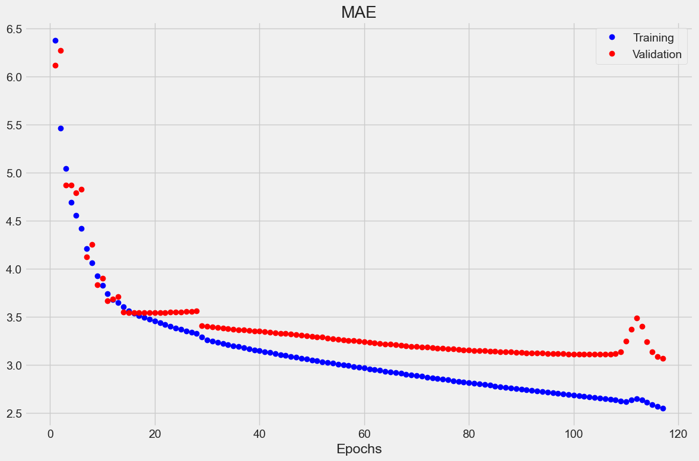

Analyse de la Densité de Foule
==============================

L'analyse de densité permet d'évaluer le nombre de personnes présentes dans une zone et leur distribution spatiale, essentielle pour détecter les situations de surpopulation ou de mouvements de panique.

Méthodologie
------------

- **Estimation par régression** : Utilisation de CNN adaptés pour prédire la densité de personnes par zone.
- **Comptage de personnes** : Combinaison de détection d'objets et de tracking pour compter avec précision.
- **Cartes de densité** : Génération de représentations visuelles indiquant les zones de forte concentration.
- **Analyse de flux** : Détection des mouvements collectifs anormaux (convergence, dispersion rapide).

Métriques surveillées
---------------------

- Nombre total de personnes dans différentes zones
- Densité par mètre carré
- Variation temporelle de la densité
- Vitesse et direction des déplacements collectifs
- Formation de clusters ou de files d'attente

Applications pratiques
----------------------

- Prévention des situations de surpopulation dangereuse
- Détection précoce des mouvements de panique
- Optimisation de la gestion des espaces publics
- Identification des goulots d'étranglement potentiels

Check the notebook: `Analysis Notebook <../notebooks/Crowd_Density_CV.ipynb>`_

Analyse de la Courbe d'Apprentissage : Erreur Absolue Moyenne (MAE)
-------------------------------------------------------------------

Analyse de la Convergence
-------------------------

**Comportement des Courbes :**

* Les deux courbes montrent une convergence initiale rapide et similaire
* La courbe d'entraînement continue de décroître de manière monotone
* La courbe de validation se stabilise après l'époque 20, puis montre des signes de dégradation

L'arrêt de l'entraînement se situe approximativement à l'époque 25-30, où :

* MAE d'entraînement ≈ 3,4
* MAE de validation ≈ 3,5
* Écart minimal entre entraînement et validation

Implications pour le Modèle
---------------------------

**Performance Atteinte :**

* **Meilleure Performance de Validation** : MAE ≈ 3,1 (vers l'époque 25-30)
* **Performance Finale d'Entraînement** : MAE ≈ 2,5 (époque 120)
* **Écart Final** : Environ 0,6-0,9 entre entraînement et validation

**Qualité de l'Apprentissage :**

* Apprentissage initial efficace et stable
* Capacité de généralisation correcte dans les premières époques
* Développement progressif du sur-apprentissage

Évaluation de la Robustesse
---------------------------
* Convergence initiale rapide et stable
* Absence d'instabilité ou d'oscillations importantes
* Performance finale acceptable (MAE < 3,5)

Spécifications Techniques
-------------------------

:Métrique d'Évaluation: Erreur Absolue Moyenne (MAE)
:Nombre d'Époques: 120
:Point Optimal Estimé: Époque 25-30
:MAE Optimale (Validation): ~3,1
:MAE Finale (Entraînement): ~2,5
:Écart Final: ~0,6-0,9
:Recommandation: Implémentation d'arrêt précoce
