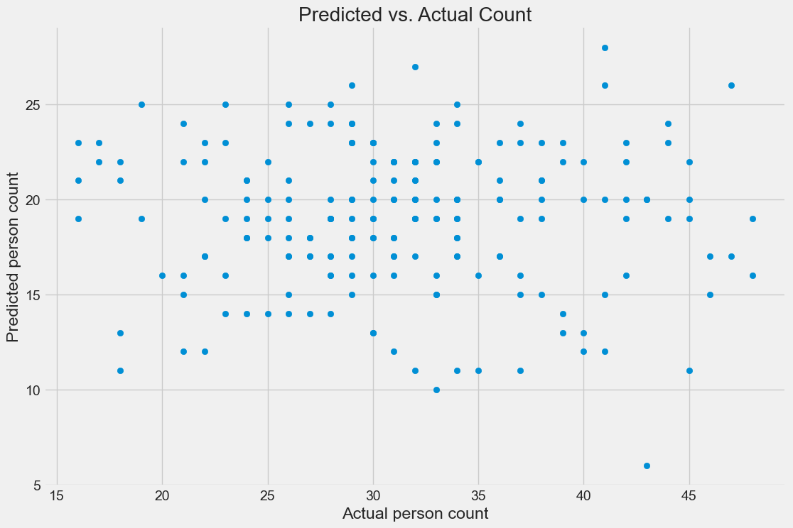

Analyse de la Densité de Foule
==============================

Check the notebook: `Crowd Density Notebook <../notebooks/Crowd_Density_CV.ipynb>`_

L'analyse de densité permet d'évaluer le nombre de personnes présentes dans une zone et leur distribution spatiale, essentielle pour détecter les situations de surpopulation ou de mouvements de panique.

Méthodologie
------------

- **Estimation par régression** : Utilisation de CNN adaptés pour prédire la densité de personnes par zone.
- **Comptage de personnes** : Combinaison de détection d'objets et de tracking pour compter avec précision.
- **Cartes de densité** : Génération de représentations visuelles indiquant les zones de forte concentration.
- **Analyse de flux** : Détection des mouvements collectifs anormaux (convergence, dispersion rapide).

Métriques surveillées
---------------------

- Nombre total de personnes dans différentes zones
- Densité par mètre carré
- Variation temporelle de la densité
- Vitesse et direction des déplacements collectifs
- Formation de clusters ou de files d'attente

Applications pratiques
----------------------

- Prévention des situations de surpopulation dangereuse
- Détection précoce des mouvements de panique
- Optimisation de la gestion des espaces publics
- Identification des goulots d'étranglement potentiels

Analyse de la Convergence
==========================

Cette section présente une analyse de la distribution des erreurs absolues du modèle, illustrée par l’histogramme ci-dessous.

.. figure:: maae.png
   :alt: Histogramme des erreurs absolues
   :align: center
   :width: 80%

   Figure 1 : Distribution des erreurs absolues du modèle sur les données de test.

Interprétation de l'Histogramme
-------------------------------

- La majorité des erreurs absolues se situent entre **5 et 15**, avec un **pic notable entre 10 et 12**.
- Très peu de prédictions présentent des erreurs supérieures à **25**, ce qui montre une **bonne maîtrise des cas extrêmes**.
- La distribution est **légèrement asymétrique**, avec une **queue vers la droite**, indiquant quelques valeurs avec des erreurs plus importantes.
- On observe que les erreurs sont **relativement bien concentrées** autour de la plage 7–15, ce qui suggère que le modèle est **cohérent dans ses prédictions**.

Évaluation de la Performance
----------------------------

- **Erreurs faibles à modérées** pour la majorité des cas, ce qui traduit une **bonne précision globale**.
- L’absence de pics extrêmes indique que le modèle est **robuste face aux outliers** ou aux cas particuliers.
- L’erreur absolue moyenne (MAE) estimée à partir de cette distribution semble être située autour de **10 à 12**.

Limites et Pistes d’Amélioration
--------------------------------

- Réduire les erreurs situées au-delà de **20** améliorerait la performance globale.
- Une **analyse des cas à forte erreur** pourrait permettre de détecter des motifs spécifiques ou des classes difficiles à prédire.
- L'ajustement de certains **hyperparamètres** ou l'intégration de **données supplémentaires** pourrait contribuer à resserrer la distribution autour de valeurs plus faibles.

Conclusion
----------

L’histogramme montre une **distribution globalement satisfaisante** des erreurs absolues, avec peu de déviations importantes. Cela indique que le modèle a bien appris les tendances des données, mais laisse une marge d’amélioration sur les cas plus complexes.

