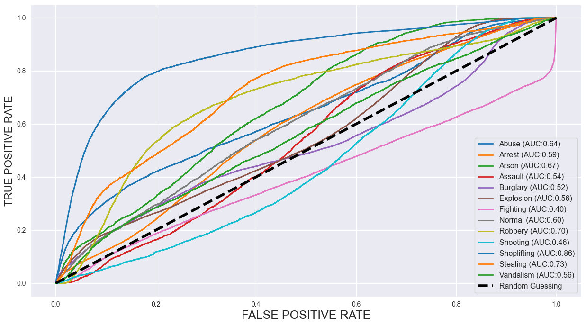

Reconnaissance d'Actions
=========================

Check the notebook: `Action Recognition Notebook <https://github.com/med-reda-nk/GuardVision/blob/main/notebooks/action_notebook.ipynb>`_

Cette composante vise à identifier des comportements suspects ou anormaux pouvant indiquer une menace potentielle.

Méthodologie
------------

- **Modèles utilisés** : Utilisation de DenseNet121 pré-entraîné sur ImageNet comme backbone, en excluant les couches fully-connected supérieures pour l'extraction de caractéristiques, avec un classifieur profond pour classifier les scènes.
- **Classification d'actions** : Identification de comportements spécifiques comme courir de manière erratique, se battre, tomber, ou adopter une posture menaçante.
- **Détection d'anomalies** : Apprentissage de modèles de comportement normal pour identifier les déviations significatives.
- **Analyse de posture** : Utilisation de frameworks comme OpenPose ou MediaPipe pour l'extraction de squelettes et l'analyse de posture.

Actions surveillées
-------------------

- Interactions violentes entre individus
- Mouvements brusques ou erratiques
- Comportements suspects (rôder, surveillance prolongée)
- Chutes ou situations de détresse
- Gestes associés à l'utilisation d'armes

Implémentation
--------------

- Extraction de caractéristiques spatio-temporelles
- Fenêtres glissantes pour l'analyse continue du flux vidéo
- Système de score pour évaluer le niveau de risque associé aux actions détectées
- Fusion des informations de multiples caméras pour une analyse cohérente

Analyse de Performance du Modèle : Courbes ROC
----------------------------------------------

Vue d'ensemble
--------------

Cette analyse présente les courbes ROC (Receiver Operating Characteristic) pour un modèle de classification multi-classes conçu pour prédire différents types d'activités criminelles. Le modèle démontre des niveaux de performance variables selon les catégories de crimes, mesurés par la métrique AUC (Area Under the Curve - Aire Sous la Courbe).

Performance du Modèle par Catégorie de Crime
---------------------------------------------

Le modèle de classification montre une variation significative de la performance prédictive selon les différents types de crimes :

**Catégories Haute Performance (AUC > 0,70) :**

* **Vol à l'étalage / Shoplifting (AUC : 0,86)** - Présente la meilleure performance prédictive, avec une courbe ROC montrant une excellente séparation par rapport à la ligne de base aléatoire
* **Vol / Stealing (AUC : 0,73)** - Démontre une bonne capacité prédictive avec une amélioration substantielle par rapport à la classification aléatoire
* **Braquage / Robbery (AUC : 0,70)** - Montre une performance solide avec une valeur prédictive significative

**Catégories Performance Modérée (AUC : 0,60-0,69) :**

* **Incendie criminel / Arson (AUC : 0,67)** - Affiche une performance prédictive modérée avec des possibilités d'amélioration
* **Abus / Abuse (AUC : 0,64)** - Montre une capacité de classification correcte au-dessus du hasard
* **Normal (AUC : 0,60)** - Représente la classification du comportement de référence avec un pouvoir prédictif modeste
* **Arrestation / Arrest (AUC : 0,59)** - Démontre une capacité prédictive limitée mais mesurable

**Catégories Performance Faible (AUC < 0,60) :**

* **Explosion (AUC : 0,56)** - Montre une amélioration minimale par rapport à la classification aléatoire
* **Vandalisme / Vandalism (AUC : 0,56)** - Présente une performance prédictive limitée
* **Agression / Assault (AUC : 0,54)** - Démontre une faible capacité de classification
* **Cambriolage / Burglary (AUC : 0,52)** - Montre une performance marginale à peine au-dessus du hasard
* **Fusillade / Shooting (AUC : 0,46)** - Performance en dessous de la ligne de base aléatoire, indiquant des problèmes potentiels du modèle
* **Bagarre / Fighting (AUC : 0,40)** - Présente une performance prédictive médiocre significativement en dessous du hasard

Interprétation des Courbes ROC
-------------------------------

Les courbes ROC tracent le Taux de Vrais Positifs (sensibilité) contre le Taux de Faux Positifs (1-spécificité) à différents seuils de classification. Observations clés :

**Caractéristiques des Courbes :**

* Les courbes plus proches du coin supérieur gauche indiquent une meilleure performance
* La ligne diagonale pointillée représente la classification aléatoire (AUC = 0,50)
* Les montées initiales plus raides indiquent une meilleure performance à faibles taux de faux positifs
* L'aire sous chaque courbe quantifie la performance globale de classification

**Distribution de Performance :**

Le modèle montre une hiérarchie claire de capacité prédictive, avec les crimes contre les biens (vol à l'étalage, vol) montrant une performance supérieure comparée aux crimes violents (fusillade, bagarre, agression). Ceci suggère que l'ensemble de caractéristiques peut être plus discriminant pour certains types de comportements criminels.

Implications du Modèle
----------------------

**Forces :**

* Excellente performance dans la détection des activités de vol à l'étalage et de vol
* Performance raisonnable dans plusieurs catégories de crimes
* Différenciation claire entre les catégories haute et basse performance

**Axes d'Amélioration :**

* Faible performance sur les crimes violents (fusillade, bagarre, agression)
* Plusieurs catégories performant au niveau ou en dessous du hasard
* Besoin potentiel d'ingénierie de caractéristiques ou d'approches de modélisation spécifiques par classe

**Recommandations :**

1. **Analyse des Caractéristiques** : Investiguer quelles caractéristiques contribuent le plus aux catégories haute performance
2. **Déséquilibre des Classes** : Examiner les problèmes potentiels de déséquilibre des classes pour les catégories peu performantes
3. **Raffinement du Modèle** : Considérer les méthodes d'ensemble ou des modèles spécialisés pour les classes sous-performantes
4. **Qualité des Données** : Revoir la qualité des données et la précision de l'étiquetage pour les catégories avec AUC < 0,50

Conclusion
----------

Le modèle de classification multi-classes démontre une performance variable selon les différentes catégories de crimes, avec des résultats particulièrement forts pour les crimes contre les biens et une performance plus faible pour les crimes violents. La variation significative des scores AUC suggère que différents types de crimes peuvent nécessiter des approches de modélisation spécialisées ou une ingénierie de caractéristiques supplémentaire pour atteindre une performance prédictive optimale.

Spécifications Techniques
-------------------------

:Type de Modèle: Classification Multi-classes
:Métrique d'Évaluation: Aire Sous la Courbe ROC (AUC)
:Nombre de Classes: 13 catégories de crimes + 1 classe normale
:Plage de Performance: AUC 0,40 - 0,86
:Comparaison de Référence: Classification aléatoire (AUC = 0,50)
