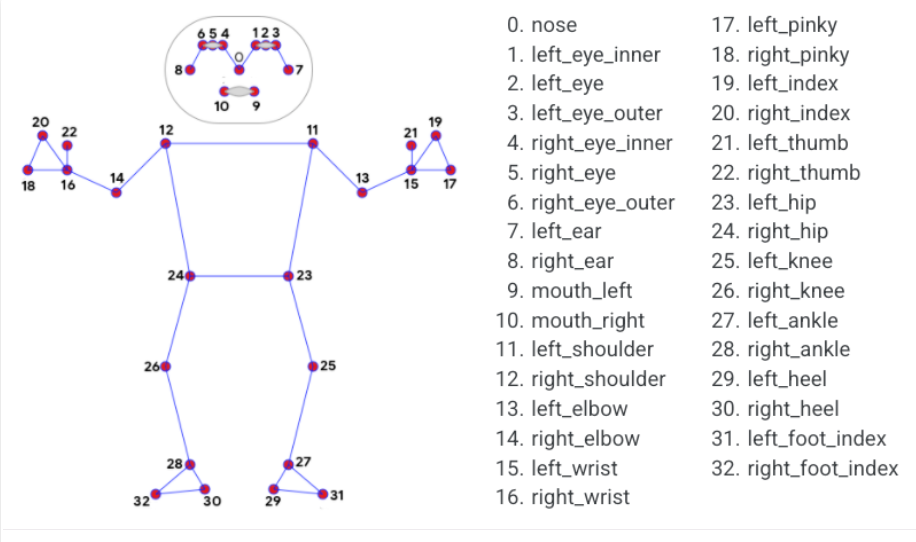

Tracking (Suivi d'Individus)
============================

Check the Test Code : `Tracking test code <../Code_test/tracking.py>`_

Le système de tracking permet de suivre les déplacements des personnes à travers l'espace surveillé, même lorsqu'elles passent d'une caméra à une autre, tout en comptant le nombre de personne présents.

Méthodologie
------------

- **Algorithmes de suivi multi-objets** : Implémentation de méthodes comme SORT (Simple Online and Realtime Tracking), DeepSORT ou ByteTrack.
- **Ré-identification de personnes** : Utilisation de caractéristiques visuelles distinctives pour maintenir l'identité d'un individu entre différentes caméras.
- **Prédiction de trajectoire** : Application de filtres de Kalman ou de modèles plus avancés pour anticiper les déplacements.
- **Association de données** : Techniques comme l'algorithme hongrois pour associer les détections entre frames successives.

Fonctionnalités avancées
------------------------

- Maintien de l'identité malgré les occlusions temporaires
- Tracking à travers des caméras non contiguës
- Analyse de trajectoires pour détecter des comportements suspects
- Recherche rétrospective d'individus dans les enregistrements

Défis techniques
----------------

- Gestion des occlusions dans les zones densément peuplées
- Maintien des identités sur de longues périodes
- Coordination entre multiples caméras avec des angles et éclairages différents
- Optimisation pour le traitement en temps réel
