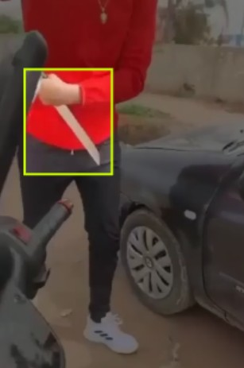

Détection d'Armes
=================

Check the notebook: `Weapon Detection Notebook <https://github.com/med-reda-nk/GuardVision/blob/main/notebooks/weapon_notebook.ipynb>`_

La détection d'armes constitue un élément critique de notre système de surveillance. Cette fonctionnalité repose sur des techniques avancées de vision par ordinateur et d'apprentissage profond.

Méthodologie
------------

- **YOLO (You Only Look Once)** : Utilisation de cette architecture basée sur un seul réseau neuronal convolutif pour prédire les étiquettes de classe et les boîtes d'objets délimitées dans une image ou une vidéo en un seul passage, ce qui le rend plus rapide et plus efficace que les méthodes de détection à plusieurs étapes. Le modèle a été spécifiquement entraîné pour identifier différents types d'armes.
- **Base de données d'entraînement** : Constitution d'un dataset diversifié comprenant différentes armes (armes à feu, armes blanches), sous divers angles, conditions d'éclairage et distances, en prenant en considération les besoins spécifiques pour le contexte marocain.
- **Augmentation de données** : Application de techniques comme la rotation, le changement d'échelle et les variations de luminosité pour améliorer la robustesse du modèle.

Défis techniques
----------------

- Réduction des faux positifs (objets ressemblant à des armes)
- Détection en temps réel avec latence minimale
- Identification dans des conditions sous-optimales (faible luminosité, occlusion partielle)
- Adaptation à différents types d'armes, en se focalisant sur les plus courantes

Implémentation
--------------

- Pipeline de traitement d'images comprenant prétraitement, détection et classification
- Optimisation pour fonctionnement sur GPU/TPU
- Seuil de confiance ajustable selon le niveau de sécurité requis
