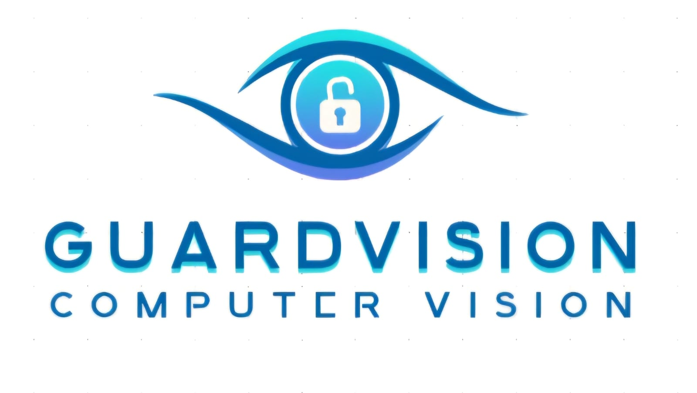

GuardVision - Computer Vision project
===================================================
Étude académique avancée sur la vision par ordinateur : Renforcement des compétences théoriques et pratiques, réalisé dans le cadre de la formation à l’ENSAM Meknès, filière IATD-SI

- **Superviseur** :  Mr. MASROUR Tawfik |linkedin_Masrour|

- **Réalisé par** :   Nkira Mohamed Reda |linkedin_Nkira| & Zouga Mouhcine |linkedin_zouga|  

Lien vers github repository:  `Cliquez ici <https://github.com/med-reda-nk/GuardVision>`__ 

.. toctree::
   :maxdepth: 3
   :caption: Rapport du projet

   Introduction.rst
   détection d'arme.rst
   Reconnaissance d'Actions.rst
   Analyse de la Densité de Foule.rst
   Tracking.rst
   Intégration et Architecture Système.rst
   Évaluation et Validation.rst
   interface_test.rst
   nlp.rst
   guide.rst
   Considération Éthiques et Légales.rst
   Conclusions et Perspectives.rst
