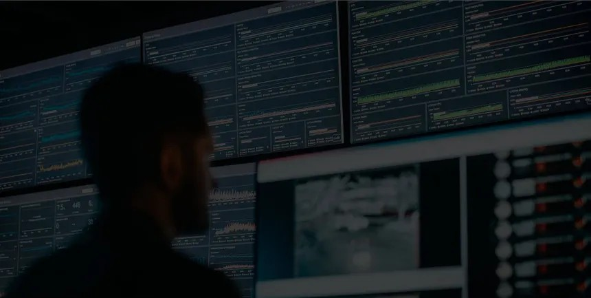

GuardVision
===================================================

- **Superviseur** :  Mr. MASROUR Tawfik |linkedin_Masrour|
.. |linkedin_Masrour| image:: Documentation/images/linkedinn.jfif
    :width: 20
    :height: 20
    :target: https://www.linkedin.com/in/tawfik-masrour-43163b85/

- **Réalisé par** :   Nkira Mohamed Reda |linkedin_Nkira| & Zouga Mouhcine |linkedin_zouga|  
.. |linkedin_nkira| image:: images/linkedinn.jfif
    :width: 20
    :height: 20
    :target: https://www.linkedin.com/in/mohamed-reda-nkira/
.. |linkedin_zouga| image:: images/linkedinn.jfif
    :width: 20
    :height: 20
    :target: https://www.linkedin.com/in/mouhcine-zouga/

Lien vers github repository:  `Cliquez ici <https://github.com/med-reda-nk/GuardVision>`__ 

Lien vers google colab notbooks:  `Cliquez ici <https://github.com/A-Lahcen10/plastics-Waste-detection-and-Tracking/blob/main/notebooks/train-yolo11-object-detection-on-custom-dataset.ipynb>`__

.. toctree::
   :maxdepth: 3
   :caption: Plan de la documentation

   Documentation/Introduction.rst
   Documentation/détection d'arme.rst
   Documentation/Reconnaissance d'Actions.rst
   Documentation/Analyse de la Densité de Foul.rst
   Documentation/Tracking.rst
   Documentation/Intégration et Architecture Système.rst
   Documentation/Évaluation et Validation.rst
   Documentation/Considération Éthiques et Légales.rst
   Documentation/Conclusions et Perspectives.rst

