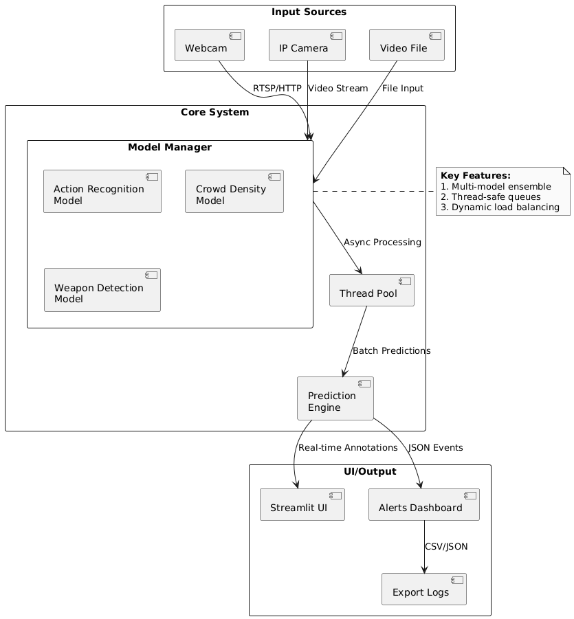

GuardVision Test - Test du Système de Surveillance Intelligent en Temps Réel
==================================================================

Check the Test code : `Test Interface <../Code_test/model_managing.py>`_

Un système de surveillance combinant reconnaissance d'actions et analyse de densité de foule utilisant des modèles TensorFlow.

Fonctionnement
--------------

Architecture du Système
~~~~~~~~~~~~~~~~~~~~~~
1. **Entrée Vidéo** : Capture en direct depuis webcam/caméra IP
2. **Traitement par Modèles** :
   - Reconnaissance d'Actions : Détecte les comportements suspects
   - Densité de Foule : Estime le nombre de personnes
3. **Système d'Alerte** : Déclenche des avertissements visuels

    Diagramme de flux de données

Composants Clés
~~~~~~~~~~~~~~~
- ``ModelManager`` : Gère le chargement des modèles et l'inférence multi-thread
- ``NLPReportGenerator`` : Génère le rapport de surveillance
-  ``OptimizedPoseDetector``: Défini le corps human et le suit

