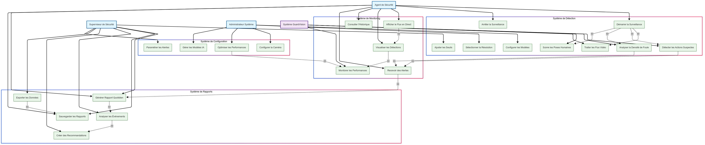
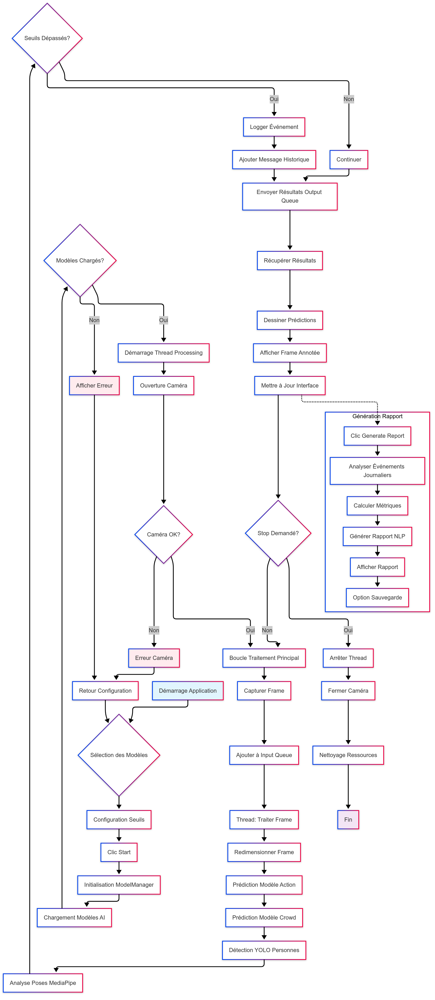
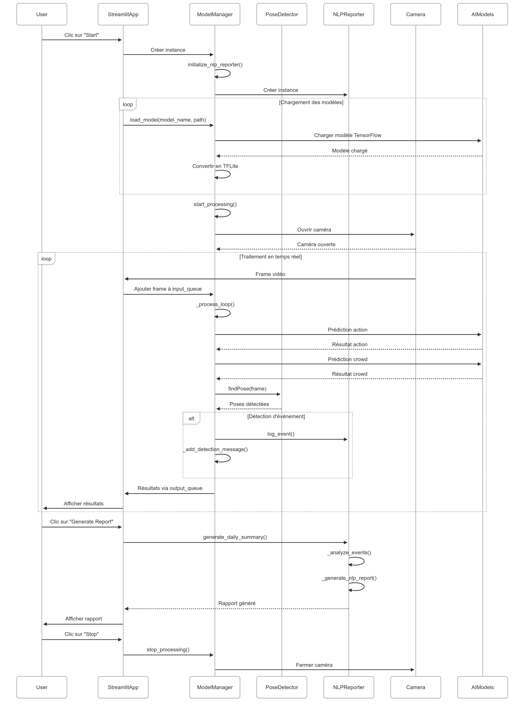
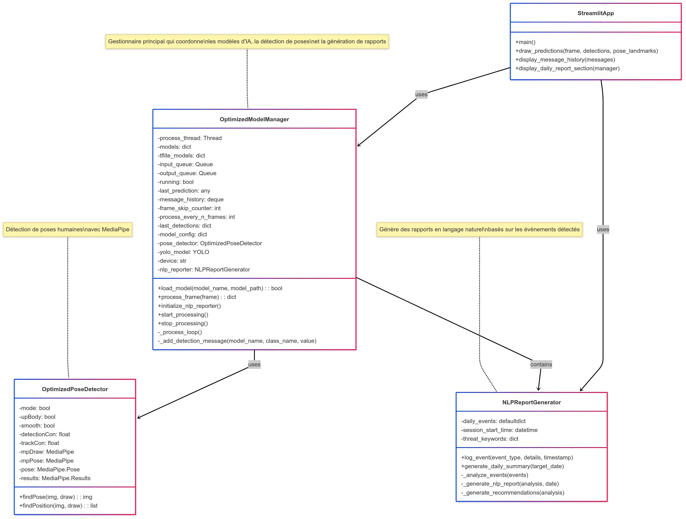

Architecture et Conception du Système
=====================================

Cette section fournit un aperçu complet de l’architecture du système ainsi que de ses principaux aspects comportementaux et structurels à travers plusieurs diagrammes UML.

Vue d’ensemble
--------------

La conception comprend :

- Un **diagramme de cas d’utilisation** pour décrire les interactions externes avec le système.
- Un **diagramme d’activités** pour illustrer le déroulement logique interne.
- Un **diagramme de séquence** pour représenter le flux de communication entre les composants.
- Un **diagramme de classes** pour définir la structure interne du système.

Diagramme de Cas d’Utilisation
------------------------------

Le diagramme de cas d’utilisation met en évidence les interactions entre l’utilisateur et les fonctionnalités du système :

   Figure 1 : Diagramme de cas d’utilisation illustrant le périmètre fonctionnel du système.

Diagramme d’Activités
---------------------

Le diagramme d’activités fournit une vue d’ensemble du déroulement logique des étapes d’exécution :

   Figure 2 : Diagramme d’activités représentant le flux opérationnel du système depuis le démarrage jusqu’à l’affichage des résultats.

Diagramme de Séquence
---------------------

Le diagramme de séquence montre comment les composants du système interagissent dans le temps lors d’une demande de prévision :

   Figure 3 : Diagramme de séquence illustrant la communication ordonnée dans le temps entre les composants pendant une prévision initiée par l’utilisateur.

Diagramme de Classes
--------------------

Le diagramme de classes définit la structure interne, montrant comment les composants et les classes sont liés :

   Figure 4 : Diagramme de classes représentant la structure modulaire de l’application.

Conclusion
----------

Ces diagrammes UML permettent de fournir une compréhension claire et organisée de l’architecture du système ainsi que de son comportement dynamique, facilitant ainsi la mise en œuvre, les tests et les améliorations futures.
